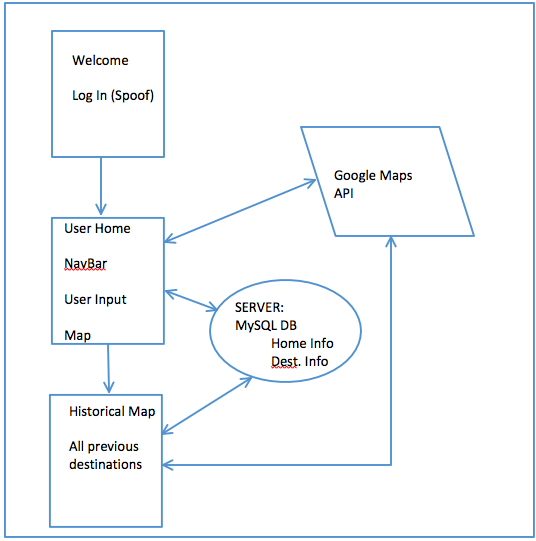

# Alta-Coding-Challenge
4-Hr Coding Challenge
AFTER 4 HOUR MARK - Comments:
	"I adhered to the 4 hour rule, taking a few breaks here and there. However, even using code from apps ive written before, I could not reach all the requirements.  I had started desiging in the MVC file structure to demonstrate my ability to work with it, but it ended up taking a lot more time than if I simply had an HTML, CSS, and JS file.  I started with the backend, which in hindsight may not have been the correct choice, however, it was a useful learning experience.  I hope you will take the time to review my code, most of the backend is complete what I am missing is User Input fields, Google MAPs API calls using User input / DB, functions to store user input into the DB. Please see the rest of the readme for my plans.  Although I did not finish in the alloted time, I know i could make this a functional and attratiee app if given a few more hours."

Location 
- Los Angeles

Requirements:

- Identify HOME ADDRESS
	
- Submit HOME and DESTINATION
	○ Click map or Text Address
		
- Display CATEGORY of DESTINATION
		
- Display / Allow Selection of Commute Modes
		
- Alta Logo and Colors
	
- MySQL DB 
	○ Home / Destination
		
- Map of all DB locations

- Repo on GitHub
	
- Host on Heroku

Stretch Goals / Proof of Concept / Considerations:

- User Authentication 
- Full CRUD
  

